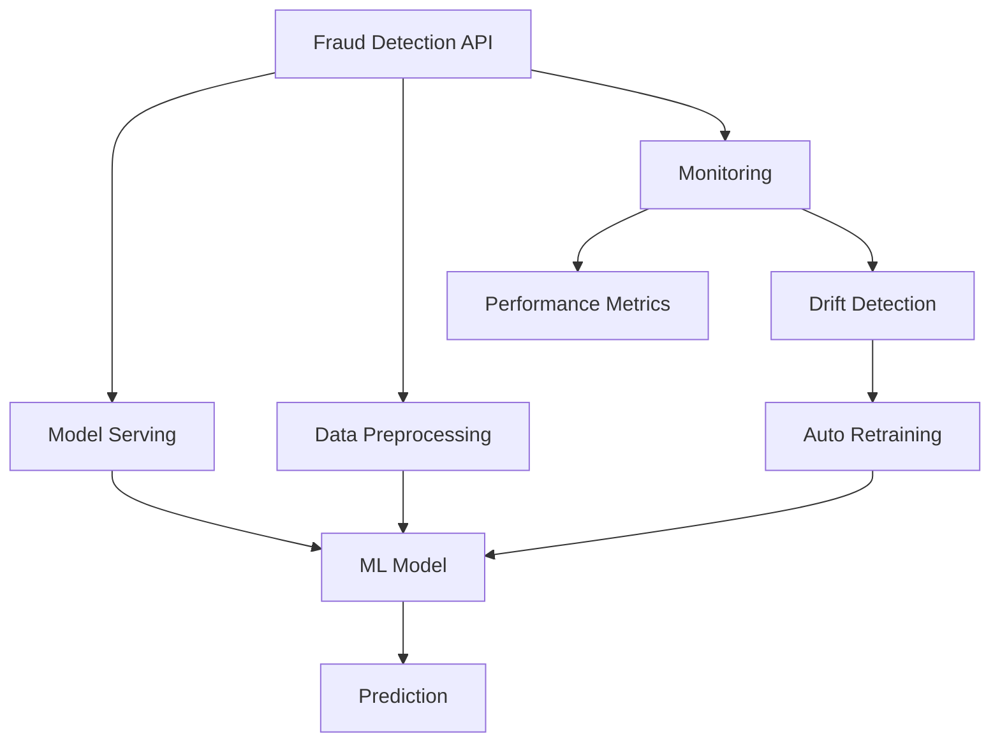

# Fraud Detection System - Deployment Overview

This document provides a concise overview of the deployment architecture and CI/CD pipeline for the Fraud Detection system.

## Architecture Overview

Fraud Detection Architecture (Use the `Markdown Preview Mermaid Support` VS Code extension to view the following diagram):

## Deployment Components

### 1. Docker Containerization

- **Base Image**: Python 3.11-slim
- **Container Services**:
  - Fraud Detection API (main service)
  - Prometheus (metrics collection)
  - Grafana (visualization and dashboards)

### 2. CI/CD Pipeline (GitHub Actions)

Our CI/CD pipeline consists of the following stages:

1. **Linting & Code Style Checks**

   - Black for code formatting
   - isort for import organization
   - flake8 for code quality

2. **Unit Tests**

   - pytest for code testing
   - Code coverage reporting

3. **Model Performance Testing**

   - Synthetic dataset generation for tests
   - Model training verification
   - Performance metric validation (F1 score, precision, recall)

4. **Integration Tests**

   - API endpoint validation
   - Metrics endpoint testing
   - Docker container testing

5. **Build & Push**

   - Docker image building
   - Publishing to container registry
   - Multi-tag support (branch name, commit hash)

6. **Deployment**
   - Staging deployment (development branch)
   - Production deployment (main branch)
   - Deployment verification

### 3. Model Monitoring & Maintenance

We've implemented automated monitoring and retraining:

1. **Daily Model Performance Checks**

   - Performance metrics calculation on production data
   - Drift detection compared to baseline metrics
   - Automatic alerting when drift exceeds thresholds

2. **Automated Retraining Pipeline**
   - Triggered by detected model drift
   - Fetches latest production data
   - Retrains model with optimal parameters
   - Verifies new model performance
   - Creates pull request with updated model

## Infrastructure Requirements

For a production deployment, you'll need:

1. **Container Registry**

   - DockerHub (currently configured)
   - Or alternative: AWS ECR, GCP Container Registry, Azure Container Registry

2. **Compute Infrastructure**

   - Kubernetes cluster (recommended)
   - Or: AWS ECS, GCP Cloud Run, Azure Container Instances

3. **CI/CD Integration**

   - GitHub Actions (implemented)
   - Required secrets:
     - `DOCKERHUB_USERNAME`
     - `DOCKERHUB_TOKEN`
     - `AWS_ACCESS_KEY_ID` (for AWS deployments)
     - `AWS_SECRET_ACCESS_KEY` (for AWS deployments)
     - `AWS_REGION` (for AWS deployments)

4. **Monitoring Stack**
   - Prometheus server (metrics collection)
   - Grafana (visualization)
   - Alert manager (notifications)

## Deployment Workflow

The typical deployment workflow is:

1. Developers push code to development branch
2. CI/CD pipeline runs tests and builds container
3. Container is deployed to staging environment
4. After approval, changes are merged to main branch
5. CI/CD deploys to production environment
6. Daily model monitoring checks for performance issues
7. If model drift is detected, automated retraining is triggered

## Security Considerations

- API authentication is recommended for production
- Secrets are managed through GitHub Actions secrets
- Container security scanning should be implemented
- Regular dependency updates are recommended

## Scaling Strategy

- Horizontal scaling is configured in docker-compose.yml
- For production Kubernetes, use HPA (Horizontal Pod Autoscaler)
- Consider separate scaling for:
  - API workers (handling requests)
  - Background processing (for batch predictions)
  - Monitoring services

## Disaster Recovery

- Models are backed up as artifacts in CI/CD
- Regular database backups are recommended
- Use container registry for image versioning
- Keep multiple environment deployments (staging/production)
